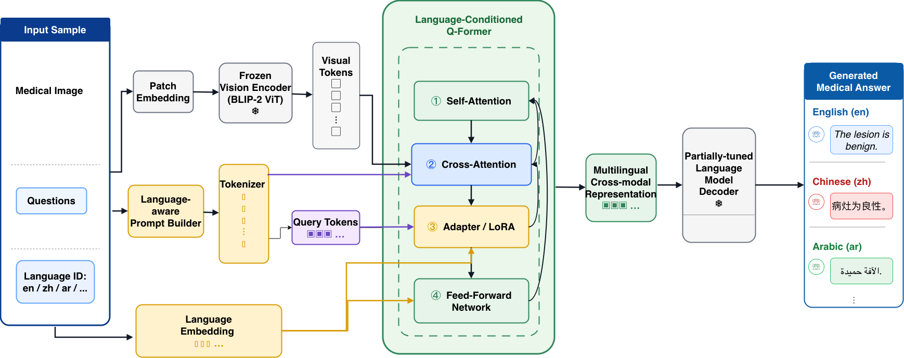

# Med-BLIP

**Multilingual Medical Visual Question Answering with a Language-Conditioned Q-Former**

<p align="center">
  
</p>

## News

> **2024-06 — MEDIQA-M3G @ NAACL-ClinicalNLP 2024**  
> Our system ranked in the **Top 10** on the [MEDIQA-M3G](https://sites.google.com/view/mediqa2024/home) shared task (*Multilingual Multimodal Medical Answer Generation*), held at the 6th Clinical NLP Workshop ([NAACL 2024](https://2024.naacl.org/)). The task targets dermatological consumer-health VQA: given a medical image and a user question, the model must produce a free-text answer in the requested language.

---

Med-BLIP adapts BLIP-2 for **multilingual medical image question answering**. Clinical VQA is rarely monolingual—patients ask questions in their native language while medical imagery stays language-agnostic. Med-BLIP closes that gap by conditioning cross-modal fusion on an explicit **language ID**, so a single model can route visual evidence into answers in English, Chinese, French, Spanish, and other supported locales without training separate pipelines per language.

The architecture keeps the heavy lifting in proven pretrained components: a **frozen BLIP-2 ViT** encodes the medical image into visual tokens; a **language-aware prompt builder** and tokenizer prepare the question together with language-specific prefix tokens; and a **Language-Conditioned Q-Former** (with optional LoRA adapters) fuses vision, text, and language embeddings into a cross-modal representation. A **partially tuned language-model decoder** then generates the final answer in the target language. Only the Q-Former adapters and decoder tuning heads are updated during training—the vision backbone and base LM weights remain frozen for parameter-efficient adaptation on limited medical data.

This repository provides an end-to-end research codebase: data formatting for MedCon and MEDIQA-style benchmarks, multilingual training and evaluation, and both a lightweight smoke backend (for pipeline testing on CPU) and the full `multilingual_blip2` backend for GPU experiments.

## Key Features

- **Language-Conditioned Q-Former** — fuses image, question, and language ID via self-attention, cross-attention, and per-language LoRA adapters.
- **Multilingual by design** — supports `en`, `zh`, `fr`, `es`, `de`, `ja`, `ko`, `pt`, `ar` out of the box.
- **Parameter-efficient fine-tuning** — frozen ViT + frozen LM; train only Q-Former adapters and decoder heads.
- **Two backends** — `smoke` (tiny CNN, CPU-friendly) for instant demos; `blip2` / `multilingual_blip2` for real experiments on GPU.
- **MedCon benchmark integration** — per-language configs and evaluation scripts under `data/medcon/`.
- **Standard metrics** — exact-match accuracy and token-level F1, reported per language and overall.

## Repository Structure

```
Med-Blip/
├── README.md
├── med-blip.png              # architecture diagram
├── requirements.txt
├── configs/
│   ├── demo.yaml             # smoke backend
│   ├── blip2.yaml            # single-language BLIP-2
│   ├── multilingual.yaml     # Med-BLIP (language-conditioned Q-Former)
│   └── medcon_{lang}.yaml    # MedCon per-language evaluation
├── data/
│   ├── demo/                 # synthetic shape-color QA (quick start)
│   └── medcon/               # multilingual medical VQA benchmark
├── outputs/
├── scripts/
│   ├── run_demo.sh           # smoke or multilingual demo
│   ├── run_multilingual.sh   # full Med-BLIP training pipeline
│   └── run_medcon.sh         # MedCon evaluation
├── src/
│   ├── data.py
│   ├── modeling.py           # smoke / blip2 / multilingual_blip2
│   ├── train.py
│   ├── evaluate.py
│   ├── infer.py
│   └── utils.py
└── tools/
    └── create_demo_dataset.py
```

## Installation

```bash
git clone https://github.com/<your-username>/Med-Blip.git
cd Med-Blip
pip install -r requirements.txt
```

Python 3.9+ is recommended. The smoke demo runs on CPU; the BLIP-2 backends require a GPU with sufficient memory (~10 GB for `blip2-opt-2.7b`).

## Quick Start

**Smoke demo** (data generation → train → evaluate → infer, no GPU):

```bash
bash scripts/run_demo.sh
# or explicitly:
bash scripts/run_demo.sh smoke
```

**Multilingual Med-BLIP** (requires GPU + HuggingFace model download):

```bash
bash scripts/run_demo.sh multilingual
# or:
bash scripts/run_multilingual.sh
```

**MedCon evaluation** (after preparing translated data under `data/medcon/{lang}/`):

```bash
bash scripts/run_medcon.sh
```

See [`data/medcon/README.md`](data/medcon/README.md) for the multilingual data layout and translation workflow.

## Dataset Format

Each training sample is one JSON line:

```json
{
  "image": "data/demo/images/sample_001.png",
  "question": "What color is the object?",
  "answer": "red",
  "lang": "en"
}
```

For multilingual training, include `"lang"` (`en`, `zh`, `fr`, …). Generate the synthetic demo set with:

```bash
python tools/create_demo_dataset.py
```

## Training & Evaluation

```bash
# Single-language BLIP-2
python src/train.py --config configs/blip2.yaml
python src/evaluate.py --config configs/blip2.yaml

# Multilingual Med-BLIP
python src/train.py --config configs/multilingual.yaml
python src/evaluate.py --config configs/multilingual.yaml
```

Checkpoints are saved under `outputs/` (or `outputs/multilingual/` per config). Predictions and per-language scores are written to `outputs/predictions.jsonl` and `outputs/scores.json`.

## Inference

```bash
python src/infer.py \
  --config configs/multilingual.yaml \
  --image path/to/image.png \
  --question "What does the lesion indicate?" \
  --lang en
```

## Configuration Highlights

`configs/multilingual.yaml` controls the green **Language-Conditioned Q-Former** block in the diagram:

| Parameter | Role |
|---|---|
| `languages` | active language set for training |
| `num_prefix_tokens` | language-aware prefix tokens per language |
| `adapter_rank` / `adapter_alpha` | LoRA rank and scaling in Q-Former |
| `lang_embed_dim` | dimension of language embedding **Lᵢ** |
| `freeze_vision` / `freeze_lm` | keep ViT and LM frozen (recommended) |

## Citation & Acknowledgements

If you use this code or build on Med-BLIP, please cite the MEDIQA-M3G shared task overview and our system description (paper link TBD).

- Ben Abacha, Asma, et al. *Overview of the MEDIQA-M3G 2024 Shared Task on Multilingual Multimodal Medical Answer Generation.* ClinicalNLP @ NAACL 2024. [ACL Anthology](https://aclanthology.org/2024.clinicalnlp-1.55/)
- Shared task page: [MEDIQA 2024](https://sites.google.com/view/mediqa2024/home)

## License

MIT
